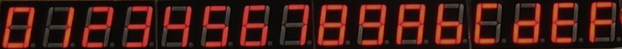
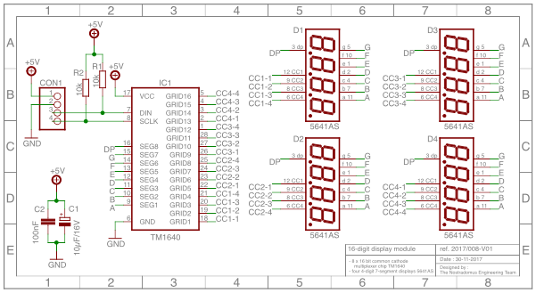

# tm1640 - 16-Digit Display Module

## What

This repository contains the schematic, a pcb design, plexi housing drawings and a code example, to build and program a 16-digit display module, based on the tm1640 multiplexer chip.

## Why

In a recent project, I used such a 16-digit 7-segment display module which I had lying around. At the end of the project, it turned out that the module was commercially not available anymore.

As all the required components can still easily be sourced, I decided to redesign a pcb in order for all interested people to be RYO.

## How

Based on the [datasheets](/pdf-files), an [Eagle-library](/eagle-files) has been created, containing specific components which are not available in the standard libraries. Next a [schematic](#electronics) has been drawn, as a base for the [pcb](#display-board) design.

## Progress status

 - [x] create an [eagle library](/eagle-files) with the specific components
 - [x] draw the [schematic](#electronics)
 - [ ] draw and route a [pcb](#display-board)
 - [ ] design and build an example [housing](#mechanical-construction)  
 - [ ] publish [mechanical build-files](pdf-files/) for the prototype
 - [ ] publish demo [code for the µ-controller](source/)
 - [ ] write [documentation](https://github.com/nostradomus/tm1640_16-digit_display/wiki)

## Technical details

### Specifications

 - 4 common cathode, 0.56" high, 7-segment quad-digits with a decimal point for each digit
 - a tm1640 8 x 16 common cathode multiplexer chip, with two line communication (clock/data)

### Electronics

#### display board

More coming soon.............

### µ-Controller code

The demo software has been written in the free [Arduino IDE](https://www.arduino.cc/en/Main/Software), or as [sourcecode](https://github.com/arduino/Arduino/). A specific library is required to test this display successfully :

function                                    | library                                                | documentation
--------------------------------------------|--------------------------------------------------------|----------------------------------------------------------
16-digit display driver (tm1640 chip)       | [link](https://github.com/rjbatista/tm1638-library/)   | [link](https://github.com/rjbatista/tm1638-library/wiki)

This [source folder](source/) contains a snapshot from the library at the time of build (tested version). The library can be installed using the [standard procedure](https://www.arduino.cc/en/Guide/Libraries).

As the demo application has been written as an Arduino sketch, there are various ways to load the code in the controller. As a universal solution, I used the ICSP connector on the µ-controller board in combination with my [programming shield](https://github.com/nostradomus/ATtinyISPprogrammerShield). Instructions on how to proceed can be found in [this repository](https://github.com/nostradomus/ATtinyISPprogrammerShield). A basic serial-to-USB adapter has been connected to debug the application. You can use your favorite serial console software, or use the [python script](tools/SerialMonitor.py) included in the [tools folder](tools/) of this project.

Below firmware is available in the [source folder](source/) :

version | name                                        | description
--------|---------------------------------------------|--------------------------------------------------------------------------------------------
v1.0    | [*.ino](source/*.ino) |

### Mechanical construction

The example housing for the electronics consists of several layers of lasercut and engraved plexi plates (3 & 6mm). The required files to cut out these plexi sheets are available both in [.cdr or CorelDraw format](laser-cutting-files/) or in [pdf format](pdf-files/). A legend on which color to use for which action (contour cutting, inside cut-outs, engraving) is available as an instruction in the [readme document](laser-cutting-files/README.md) which is accompanying the files.

### Building instructions

More coming soon.............

## Contributors

If you are having any good suggestions, just drop me a line [:email:](http://nostradomus.ddns.net/contactform.html).
If feasible, I'll be happy to implement proposed improvements.
And if you are having lots of time, I'll be happy to share the work with you ;-).

When you create your own version, don't forget to send us some nice pictures of your construction. We'll be happy to publish them in the :confetti_ball:Hall of Fame:confetti_ball:.

## :globe_with_meridians: License

At this moment, there is no specific license attached to this project yet.

So, today, if you like it, have fun with it (at your own risk of course :-D), and especially, be creative.

Oh, and when using anything from this repository, it is highly appreciated if you mention its origin.

If you would like to use any of this work (or the whole project) for commercial use, first [contact us :email:](http://nostradomus.ddns.net/contactform.html), so we can add the appropriate license, which best fits your business.
